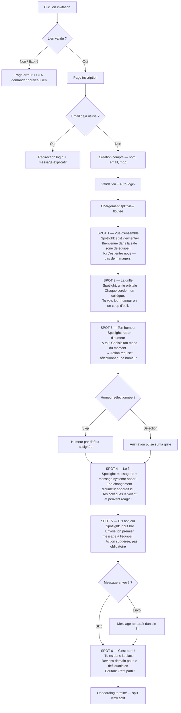
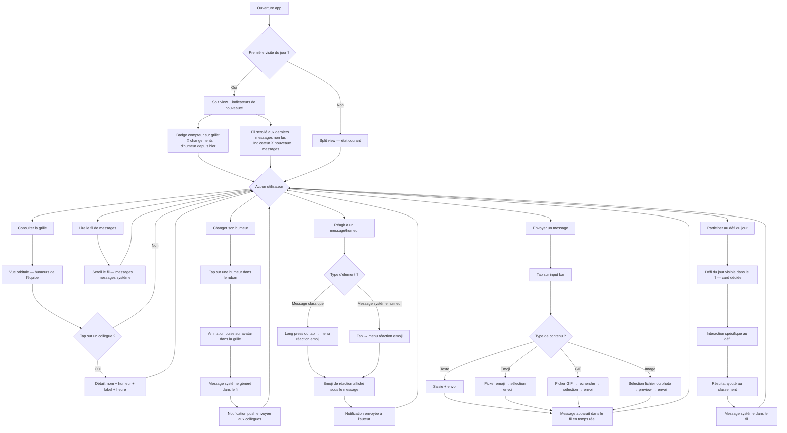
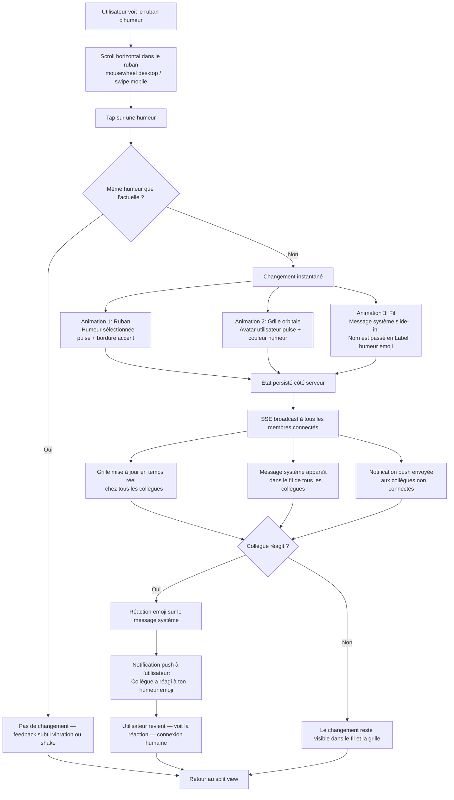

# UX Design Specification my-mood

**Author:** Vincent
**Date:** 2026-02-09

---

## Executive Summary

### Project Vision

My Mood est le "babyfoot numérique pour équipes distribuées" — un espace de cohésion d'équipe quotidien qui remplace les micro-interactions informelles perdues avec le remote. Positionnement "By employees, for employees" avec un branding underground/fun. Le produit ne doit JAMAIS ressembler à un outil RH corporate.

Architecture Dual Face : deux espaces hermétiquement cloisonnés (safe zone employé + espace manager) avec séparation architecturale. Seul pont : un signal volontaire initié par l'employé.

### Target Users

**MVP :** Un seul profil — le membre d'équipe (persona Sarah). Pas de rôle manager ou admin.

**Profil type :** Collaborateur en équipe distribuée/hybride (5-15 personnes), tous niveaux techniques (devs, commerciaux, RH, créatifs...). Utilise Slack/Teams au quotidien mais ressent la surveillance implicite de ces canaux "publics".

**Contexte d'usage :** Fragmenté et opportuniste — check-in matinal (mobile, café), pauses entre réunions, pause déjeuner, micro-moments dans la journée. Desktop en onglet permanent OU mobile en réflexe rapide. Le produit doit fonctionner pour des sessions de 30 secondes comme pour des sessions de 10 minutes.

**Moment "aha!" :** Social et émotionnel — rire en voyant un message/gif d'un collègue, ou constater que ses collègues réagissent à son changement d'humeur. Le déclic est la connexion humaine, pas la fonctionnalité.

### Key Design Challenges

1. **Interaction ultra-rapide** — L'usage fragmenté exige un check-in humeur et une consultation des messages en quelques secondes. Toute friction tue le rituel quotidien.
2. **Safe zone par le design** — Le sentiment de liberté vs Slack/Teams doit être communiqué visuellement et émotionnellement, pas par des textes légaux. Le design EST la promesse de confiance.
3. **Accessibilité universelle** — Des profils non-tech doivent se sentir chez eux. Presets d'environnement (humeurs, ton, thème) découvrables sans jargon. Onboarding immédiat.
4. **Boucles de feedback social** — Le "moment aha!" est social. Si personne ne réagit à un changement d'humeur, l'utilisateur ne reviendra pas. L'UX doit maximiser la visibilité des interactions sociales.

### Design Opportunities

1. **Contraste émotionnel** — Direction artistique tellement différente du corporate qu'elle devient un mécanisme de confiance et un vecteur de viralité.
2. **Presets d'environnement = identité d'équipe** — Chaque équipe choisit son ambiance (humeurs, bot, thème). Construction d'identité collective et sentiment d'appartenance.
3. **Rituel quotidien orchestré** — Séquence matinale humeur → défi → messages en 60 secondes. Pattern UX qui crée l'habitude.
4. **Mobile-first comme réflexe** — Le check-in café du matin avant d'ouvrir le laptop. Le mobile est le premier contact quotidien, pas une version dégradée.

## Core User Experience

### Defining Experience

L'expérience fondamentale de My Mood est la **boucle sociale autour de l'humeur**. Le check-in humeur n'est pas le produit — c'est le déclencheur d'interactions sociales. L'humeur est un prétexte pour créer de la connexion entre collègues.

**Layout fondamental — le split view :**
- **Côté gauche : la grille d'humeur** — Vue d'ensemble visuelle de l'équipe. Tableau de bord "comment va l'équipe en un coup d'œil". Changer son humeur en un tap.
- **Côté droit : la messagerie groupe** — Le cœur vivant de l'équipe. Flux continu de messages, GIFs, réactions ET changements d'humeur. Toujours visible, toujours active.

**Principe clé :** Chaque changement d'humeur génère automatiquement une ligne dans la messagerie groupe (message système). Cela rend les changements d'humeur impossibles à rater et naturellement réactionnables — on réagit à un changement d'humeur exactement comme on réagit à un message.

**Conversations privées :** Traitées séparément — pages dédiées ou fenêtres flottantes. Le chat groupe reste toujours visible en arrière-plan.

**Boucle core :**
1. L'utilisateur ouvre l'app → voit le split view (grille + messagerie) → vie de l'équipe immédiatement visible
2. Change son humeur en un tap sur la grille → une ligne apparaît dans la messagerie → l'équipe le voit instantanément
3. Les collègues réagissent au message système → notification push → l'utilisateur revient
4. L'utilisateur envoie un message/GIF dans le fil → le défi du jour apparaît dans le flow → boucle continue

**Scénario catastrophe résolu :** Un changement d'humeur ne peut PAS passer inaperçu puisqu'il vit dans le même flux que les messages. La grille + le fil de messagerie sont deux facettes du même événement.

### Platform Strategy

**PWA responsive-first** — pas d'app native, installable depuis le navigateur.

- **Desktop :** Le split view grille + messagerie prend tout son sens. Onglet permanent ou app installée. C'est l'expérience complète.
- **Mobile :** Le split view s'adapte — probablement un layout en tabs ou en swipe (grille ↔ messagerie) plutôt qu'un split côte à côte. Check-in matinal café, micro-sessions entre réunions. Interface optimisée pour le tap one-handed.
- **Offline :** Non requis. Le produit est intrinsèquement social et temps réel.
- **Contraintes réseau :** Pas de contraintes spécifiques. SSE pour la propagation des humeurs et réactions, WebSocket pour la messagerie.

**Notifications push :**
- Activées par défaut pour tout (changements d'humeur, réactions, messages, défis quotidiens)
- Contrôle granulaire dans la section "Paramètres de notifications" de la page Mon Compte
- L'utilisateur peut désactiver par catégorie sans perdre l'expérience core

### Effortless Interactions

**Zéro friction obligatoire :**
- **Changer son humeur** — 1 tap sur la grille, propagation instantanée dans le fil de messagerie. Pas de confirmation, pas d'étape intermédiaire.
- **Réagir à une humeur** — 1 tap sur le message système dans le fil. Même geste que réagir à un message classique.
- **Envoyer un message** — La messagerie est toujours visible, toujours accessible. Texte, emoji, GIF avec le minimum de taps.
- **Consulter l'activité** — Le split view montre tout d'un coup d'œil. Pas de navigation pour voir "ce qui se passe".

**Automatismes :**
- Les changements d'humeur génèrent automatiquement des messages système dans le fil
- Le feed se met à jour en temps réel sans refresh
- Les notifications arrivent sans que l'utilisateur ait à "checker"
- Le défi du jour apparaît naturellement dans le flow de messagerie

### Critical Success Moments

1. **Premier check-in (onboarding)** — L'utilisateur doit voir le split view et comprendre le fonctionnement en quelques secondes. Premier changement d'humeur dans les 60 premières secondes → sa ligne apparaît dans le fil.
2. **Première réaction reçue** — Un collègue réagit au message système de son changement d'humeur. C'est LE moment "aha!" — la preuve que l'espace est vivant.
3. **Premier éclat de rire** — Un GIF/message drôle d'un collègue dans le fil. Le moment où l'utilisateur comprend que c'est un espace de liberté.
4. **Retour le lendemain** — L'utilisateur revient de lui-même. Les notifications + le défi quotidien + la curiosité sociale créent le réflexe.

### Experience Principles

1. **"Social-first, mood-second"** — L'humeur vit dans le fil de messagerie, pas dans un silo séparé. Chaque changement est un événement social visible et réactionnable.
2. **"Zéro tap superflu"** — Changer d'humeur = 1 tap. Réagir = 1 tap. L'utilisateur ne doit jamais réfléchir à "comment je fais".
3. **"Tout est vivant"** — Le temps réel est le cœur du produit. Le split view montre un espace qui respire — jamais d'état statique.
4. **"Notifié mais pas harcelé"** — Notifications par défaut sur tout, contrôle granulaire pour l'utilisateur. Ne jamais rater un moment, ne jamais spammer.
5. **"Le fil est le cœur"** — La messagerie groupe est toujours visible, toujours au centre. Les conversations privées sont secondaires et séparées (pages ou fenêtres flottantes).

## Desired Emotional Response

### Primary Emotional Goals

**Émotion primaire : la curiosité sociale**
L'émotion déclencheuse à chaque ouverture de l'app est la curiosité — "Qu'est-ce qui s'est passé ? Comment vont les autres ?" C'est cette curiosité qui crée le réflexe de retour quotidien. L'interface doit immédiatement montrer que quelque chose s'est passé depuis la dernière visite (indicateurs de nouveauté, activité récente visible d'un coup d'œil).

**Émotion secondaire : la complicité**
L'utilisateur doit se sentir dans un espace "entre nous". Pas entre employés — entre potes. Le ton, les micro-interactions et les easter eggs construisent un sentiment de club privé. My Mood est le groupe WhatsApp des collègues, pas l'intranet RH.

**Émotion tertiaire : l'amusement**
Rire est le meilleur indicateur de santé du produit. Si les utilisateurs ne rient pas au moins une fois par session, quelque chose ne va pas. L'humour est le moteur d'engagement n°1.

### Emotional Journey Mapping

| Moment | Émotion visée | Mécanisme UX |
|--------|--------------|--------------|
| **Ouverture de l'app** | Curiosité | Feed d'activité avec indicateurs de nouveauté, compteur de changements depuis dernière visite |
| **Consultation du fil** | Amusement + complicité | Messages, GIFs, réactions des collègues visibles immédiatement |
| **Changement d'humeur** | Expression libre | 1 tap sans jugement, grille adaptée au thème de l'équipe |
| **Réception d'une réaction** | Connexion humaine | Notification push + animation de réaction en temps réel |
| **Découverte du défi du jour** | Surprise + amusement | Apparition dans le fil, ton décalé adapté au thème |
| **Premier usage (onboarding)** | Surprise + confiance | Ton immédiatement décalé, anti-corporate dès la première seconde |
| **Erreur / problème** | Amusement plutôt que frustration | Messages d'erreur humoristiques, cohérents avec le thème choisi |

### Micro-Emotions

**Confiance vs. Surveillance — L'enjeu émotionnel n°1**

L'émotion à éviter par-dessus tout : **se sentir surveillé**. Chaque choix de design doit être évalué à travers ce filtre. La confiance se construit par deux mécanismes complémentaires :

**1. Le signal culturel permanent (ton décalé/underground)**
- Le branding, les animations, le wording créent un contraste viscéral avec les outils corporate
- Si ça ressemble à un outil d'entreprise, même à 1%, la confiance est cassée
- Micro-animations humoristiques anti-managériales apparaissant occasionnellement ou déclenchées par certaines actions (GIFs, memes, panneaux de grévistes...)

**2. Les mécanismes explicites drôles**
- **Le bouton "Accès Manager"** — Un faux bouton visible dans l'interface. Au clic → page avec un gros panneau "C'est mort ! Pas de managers ici !" + explication humoristique de pourquoi la safe zone est safe + rappel que les données/messages sont et resteront toujours privés. Transforme le message de confidentialité en moment de complicité.
- Ce pattern (transformer la pédagogie en humour) peut être décliné sur d'autres points de friction de confiance

**Autres micro-émotions critiques :**
- **Appartenance > Isolation** — L'utilisateur doit sentir qu'il fait partie d'un groupe vivant, pas qu'il interagit avec un outil
- **Expression libre > Obligation** — Ne jamais donner l'impression que l'utilisateur DOIT poster/réagir. Pas de compteurs de participation, pas de "vous n'avez pas posté depuis X jours"
- **Légèreté > Gravité** — Même quand quelqu'un poste une humeur négative, l'environnement reste bienveillant et léger, pas clinique

### Design Implications

**Les thèmes émotionnels — la personnalité de l'app est configurable**

L'interface n'a pas UNE personnalité mais PLUSIEURS, choisies par l'équipe. Chaque thème est une personnalité émotionnelle complète qui affecte le ton des copies, le style visuel, les animations, les labels d'humeur, la personnalité du bot et les easter eggs.

**Thèmes identifiés :**

| Thème | Personnalité | Univers émotionnel |
|-------|-------------|-------------------|
| **Le Sarcastique** | Humour 100%, parfois noir | Ironie bienveillante, punchlines, références pop culture |
| **Le Syndiqué** | Drôle et décalé | Grève, flemme assumée, panneaux revendicatifs, pause café sacrée |
| **Le Vacancier** | Détente et cocotiers | Chill, plage, cocktails, "on est pas bien là ?" |
| **Le Bon Pote** | Cool et rassurant | Bienveillance, encouragements, "ça va aller" |
| **La Besta** | Girly et paillettes | Glamour, emojis cœur, "trop stylée", drama assumé |

**Impact du thème sur l'UX :**
- Labels de la grille d'humeur adaptés au thème (ex. "Le Syndiqué" : "En grève" au lieu de "Frustré")
- Ton des messages système adapté ("Le Sarcastique" : "Encore un lundi... Sarah a changé son humeur")
- Personnalité du Mood Bot calibrée sur le thème
- Animations et easter eggs cohérents avec l'univers
- Messages d'erreur et d'onboarding dans le ton

**Monétisation potentielle :** Thème par défaut en Free, thèmes additionnels en plan payant (Team/Business).

### Emotional Design Principles

1. **"La curiosité avant tout"** — Chaque ouverture de l'app doit déclencher "qu'est-ce que j'ai raté ?". Indicateurs de nouveauté, compteurs d'activité, preview des dernières interactions.
2. **"L'humour est le bouclier"** — La confiance se construit par le rire, pas par les CGU. Chaque point de friction potentiel (confidentialité, onboarding, erreurs) est traité avec humour.
3. **"Zéro pression"** — Ne jamais faire sentir à l'utilisateur qu'il DOIT participer. Pas de gamification culpabilisante, pas de streaks, pas de "vous n'avez pas posté".
4. **"Le thème est l'âme"** — La personnalité émotionnelle de l'app est configurable par équipe. Le thème n'est pas un skin — il définit le ton, le wording, les animations et l'expérience entière.
5. **"Anti-corporate par réflexe"** — En cas de doute sur un choix de design, choisir l'option la moins corporate. Si ça pourrait exister dans un intranet RH, c'est la mauvaise option.

## UX Pattern Analysis & Inspiration

### Inspiring Products Analysis

**WhatsApp — Référence messagerie**

| Aspect | Ce qui marche | Application à My Mood |
|--------|--------------|----------------------|
| **Simplicité du chat** | Input bar toujours visible, envoi instantané, zéro friction | La messagerie groupe doit être aussi fluide — input bar permanent, envoi en un tap |
| **Réactions** | Long press → menu emoji rapide, réaction visible sous le message | Pattern identique pour réagir aux messages ET aux changements d'humeur (messages système) |
| **Bulles de messages** | Distinction claire moi/autres, horodatage discret, statut de lecture | Adapter les bulles avec distinction messages utilisateur vs messages système (humeur) |
| **Groupe** | Dynamique de conversation naturelle, notifications granulaires, noms affichés | Le chat groupe My Mood reprend cette dynamique — c'est le "groupe WhatsApp des collègues" |
| **Media** | Envoi GIF/image simple, preview inline, emoji picker intégré | GIF picker et emoji doivent être aussi accessibles que sur WhatsApp |

**Instagram — Référence simplicité**

| Aspect | Ce qui marche | Application à My Mood |
|--------|--------------|----------------------|
| **Interactions tap-based** | Double-tap pour liker, swipe pour naviguer, gestes naturels | Tap unique pour changer d'humeur, tap pour réagir — même logique gestuelle |
| **Feedback visuel immédiat** | Animation cœur au double-tap, compteurs qui incrémentent en live | Animation de réaction visible en temps réel quand un collègue réagit à une humeur |
| **Hiérarchie visuelle** | Focus sur le contenu, chrome UI minimal, navigation en bas | Le split view doit prioriser le contenu (grille + fil) avec une navigation minimale |
| **Onboarding progressif** | L'app est utilisable immédiatement, les features se découvrent | My Mood doit être compréhensible dès la première ouverture — onboarding par l'usage |

**Slack — Anti-inspiration fonctionnelle**

| Aspect | Problème identifié | Leçon pour My Mood |
|--------|-------------------|-------------------|
| **Surveillance implicite** | Canaux publics, managers présents, historique accessible à tous | My Mood = safe zone, pas de managers, pas de visibilité croisée |
| **Surcharge informationnelle** | Trop de canaux, trop de notifications, fatigue d'attention | My Mood = un seul espace groupe + conversations privées. C'est tout. |
| **Ton corporate** | Même avec des emojis custom, ça reste un outil pro | My Mood doit être viscéralement différent dès la première seconde |

### Transferable UX Patterns

**Patterns de navigation :**
- **Navigation minimale type Instagram** — Barre de navigation en bas (mobile) avec 3-4 destinations maximum. Sur desktop, sidebar minimale. Le split view est la destination par défaut.
- **Pas de hamburger menu** — Tout doit être accessible en 1-2 taps. Les paramètres sont la seule chose "cachée".

**Patterns d'interaction :**
- **Tap-to-react type WhatsApp/Instagram** — Geste unique pour toutes les réactions (humeurs, messages). Consistance gestuelle totale.
- **Input bar permanent type WhatsApp** — La zone de saisie est toujours visible dans la messagerie, jamais cachée derrière un bouton.
- **Preview media inline** — GIFs, images, emojis affichés directement dans le fil, pas en pièce jointe.
- **Micro-animations de feedback** — Chaque action produit un retour visuel immédiat (animation de réaction, changement d'humeur qui "pulse" sur la grille).

**Patterns visuels :**
- **Base épurée + surprises thématiques** — Interface minimaliste et lisible comme fondation. Les animations, easter eggs et clins d'œil du thème viennent enrichir sans surcharger.
- **Chrome UI minimal** — Peu de bordures, peu de boutons apparents, beaucoup d'espace. Le contenu (messages, humeurs, réactions) occupe l'espace maximum.
- **Animations de survol/clic non-standard** — Des micro-interactions qui surprennent sans ralentir. Exemples : un léger "bounce" au changement d'humeur, une animation thématique discrète au survol de la grille.

### Anti-Patterns to Avoid

**1. L'esthétique "HR Dashboard"**
Les outils existants (Officevibe, TINYpulse, Niko-niko) souffrent tous du même problème : ils ressemblent à des dashboards RH. Graphiques, métriques, pourcentages, couleurs pastel corporate. My Mood ne doit JAMAIS emprunter cette direction. Le bien-être est une conséquence, pas l'objectif affiché.

**2. L'effet "arc-en-ciel / cringe"**
Le piège inverse du corporate : trop de couleurs, trop d'emojis géants, mascotte infantilisante, ton condescendant ("Comment tu te sens aujourd'hui ? 😊"). Le fun doit être subtil, décalé, adulte — pas "activité team building RH".

**3. La surcharge fonctionnelle type Slack**
Trop de canaux, trop de menus, trop d'options visibles. My Mood = un espace groupe + des conversations privées. Pas de canaux multiples, pas de threads, pas d'intégrations en pagaille.

**4. La gamification culpabilisante**
Streaks ("7 jours consécutifs !"), barres de progression ("Complétez votre profil à 80%"), classements de participation. Tout ce qui donne l'impression que l'utilisateur DOIT participer.

**5. Les emojis/illustrations corporate**
Les illustrations vectorielles génériques "diversité en entreprise", les personnages sans visage en flat design. Si ça pourrait exister dans une présentation PowerPoint RH, c'est non.

### Design Inspiration Strategy

**Ce qu'on adopte :**
- La fluidité du chat WhatsApp (input bar permanent, réactions en un geste, media inline)
- La simplicité gestuelle d'Instagram (tap-based, feedback visuel immédiat, navigation minimale)
- L'onboarding par l'usage (pas de tutoriel, l'interface parle d'elle-même)

**Ce qu'on adapte :**
- Le concept de "feed" social → adapté en fil de messagerie enrichi (messages + humeurs + défis dans le même flux)
- Les réactions Instagram/WhatsApp → étendues aux messages système (changements d'humeur)
- Les micro-animations → thématisées selon le preset choisi par l'équipe

**Ce qu'on invente :**
- L'interface "base épurée + couche thématique" — un système où le squelette UX est clean et universel, mais la couche émotionnelle (animations, wording, easter eggs) est pilotée par le thème. L'équilibre délicat entre fun et lisibilité.
- Le split view grille + messagerie fusionnée — un pattern unique où les humeurs vivent dans le fil de conversation
- Les mécanismes de confiance humoristiques (bouton "Accès Manager" etc.) — transformer les messages de confidentialité en moments de complicité

**Ce qu'on évite :**
- Tout ce qui évoque un dashboard RH (graphiques, métriques, couleurs pastel corporate)
- L'effet cringe (trop de couleurs, mascotte, ton infantilisant)
- La surcharge type Slack (trop de canaux, trop d'options)
- La gamification culpabilisante (streaks, barres de progression)

## Design System Foundation

### Design System Choice

**Tailwind CSS + Angular CDK (headless)** — Contrôle total du design avec fondations comportementales solides.

- **Tailwind CSS** — Framework utility-first pour le style. Aucun style imposé, contrôle pixel-perfect, tree-shaking agressif pour un bundle léger.
- **Angular CDK** — Primitives comportementales (overlay, a11y, drag & drop, focus management, virtual scrolling) sans aucune couche visuelle.
- **Angular Animations** — API native Angular pour les micro-interactions et transitions thématiques.

### Rationale for Selection

1. **Identité unique obligatoire** — My Mood ne peut pas ressembler à une app Material ou Bootstrap. Le contrôle total du visuel est un pré-requis, pas un luxe.
2. **Système multi-thèmes natif** — Les CSS custom properties (design tokens) de Tailwind permettent de switcher tout l'univers visuel en changeant un jeu de variables. Un thème = un fichier de tokens. C'est exactement l'architecture "base épurée + couche thématique".
3. **Composants uniques** — La grille d'humeur, les messages système dans le fil, les animations thématiques n'existent dans aucune bibliothèque. On les construit from scratch de toute façon.
4. **Performance PWA** — Tailwind produit un CSS minimal via purge. Angular CDK est tree-shakable. Bundle léger = chargement rapide sur mobile.
5. **Scalabilité équipe** — Tailwind impose des conventions (utility classes, design tokens) qui facilitent l'onboarding de nouveaux développeurs. Le CDK fournit les patterns d'accessibilité sans effort.

### Implementation Approach

**Architecture du design system :**

```
src/
├── styles/
│   ├── tokens/              # Design tokens par thème
│   │   ├── _base.css        # Tokens communs (spacing, radius, typography scale)
│   │   ├── sarcastique.css  # Palette + overrides Le Sarcastique
│   │   ├── syndique.css     # Palette + overrides Le Syndiqué
│   │   ├── vacancier.css    # Palette + overrides Le Vacancier
│   │   ├── bon-pote.css     # Palette + overrides Le Bon Pote (défaut Free)
│   │   └── besta.css        # Palette + overrides La Besta
│   └── tailwind.config.ts   # Config Tailwind mappée sur les tokens
├── shared/
│   └── ui/                  # Composants UI réutilisables
│       ├── button/
│       ├── avatar/
│       ├── badge/
│       ├── input/
│       ├── emoji-picker/
│       ├── message-bubble/
│       ├── system-message/  # Messages système (humeur, défi...)
│       └── mood-cell/       # Cellule individuelle de la grille
```

**Principes d'implémentation :**
- **Composants standalone Angular 19** — Chaque composant UI est un standalone component avec ses propres styles Tailwind
- **Signals pour l'état réactif** — Le thème actif, les humeurs, les compteurs de nouveauté utilisent les Angular Signals
- **Design tokens via CSS custom properties** — `--color-primary`, `--color-surface`, `--color-mood-happy`, etc. Tailwind les consomme via `theme.extend`
- **Changement de thème = changement de classe sur `<body>`** — `<body class="theme-syndique">` change toutes les variables CSS en cascade

### Customization Strategy

**Couche 1 — Squelette universel (invariant entre thèmes) :**
- Layout split view (grille + messagerie)
- Spacing, border-radius, typographie scale
- Patterns d'interaction (tap, swipe, hover)
- Accessibilité (focus, contraste WCAG AA minimum)
- Responsive breakpoints

**Couche 2 — Design tokens thématiques (variable par thème) :**
- Palette de couleurs (primary, secondary, surface, mood states)
- Typographie (font-family peut varier par thème)
- Shadows et effets visuels
- Border styles et décorations

**Couche 3 — Contenu thématique (piloté par le backend) :**
- Labels d'humeur
- Ton des messages système
- Easter eggs et animations spécifiques
- Personnalité du Mood Bot
- Messages d'erreur et d'onboarding

Cette architecture en 3 couches permet d'ajouter un nouveau thème sans toucher au code : un fichier de tokens CSS + un jeu de contenus dans la base.

## Defining User Experience

### Defining Experience

**"My Mood, c'est la machine à café de ton équipe."**

L'expérience signature n'est pas une fonctionnalité — c'est un **lieu**. My Mood est l'espace informel où tu retrouves tes collègues sans filtres, sans managers, sans jugement. Comme la vraie machine à café : on y passe pour savoir comment vont les autres, pour rigoler, pour râler, pour se défier, ou juste pour observer.

**En une phrase :** "Retrouve ton équipe autour de la machine à café virtuelle — change ton humeur, lis les potins, relève le défi."

**Ce que l'utilisateur dit à un collègue :** "C'est comme un groupe WhatsApp mais avec les humeurs de tout le monde et un défi quotidien. Et y'a pas les managers."

### User Mental Model

**Le modèle mental dominant : le groupe de chat privé enrichi**

L'utilisateur compare instinctivement My Mood à un groupe WhatsApp/Telegram entre collègues. Ce qu'il découvre en plus : la grille d'humeur visuelle, les défis quotidiens, et la garantie explicite d'absence de surveillance. Le split view (grille + chat) est un enrichissement du modèle "groupe de chat", pas un concept radicalement nouveau.

**Quatre profils d'usage — le même utilisateur, quatre modes :**

L'utilisateur n'a pas UN profil fixe. Selon le moment de la journée, son humeur et le contexte, il bascule entre ces modes :

| Profil | Motivation | Usage principal | Ce que l'UX doit servir |
|--------|-----------|----------------|------------------------|
| **Le Social** | Connexion, potins, lien humain | Chat groupe, réactions aux humeurs, échanges de GIFs | Feed vivant, réactions faciles, conversations naturelles |
| **Le Compétiteur** | Écraser ses collègues aux défis, banter | Défi quotidien, classement, provocation humoristique | Classement visible, facilité de participation au défi, ton de banter |
| **Le Syndiqué** | Critiquer la direction, proposer des améliorations, fédérer | Chat groupe, sondages, discussions de fond | Espace d'expression libre, pas de censure, sentiment de sécurité |
| **Le Curieux** | Observer l'équipe, comprendre la dynamique, s'intégrer | Grille d'humeur, lecture du fil sans participer | Pouvoir consommer sans pression de poster, grille lisible d'un coup d'œil |

**Implications UX :**
- Le Social et le Syndiqué sont servis par la **messagerie** (côté droit du split view)
- Le Compétiteur est servi par le **défi quotidien** (dans le fil + potentiellement un espace dédié)
- Le Curieux est servi par la **grille d'humeur** (côté gauche) + le lurking dans le fil
- Aucun mode ne doit être forcé — le Curieux ne doit pas se sentir obligé de poster, le Syndiqué ne doit pas se sentir censuré

### Success Criteria

**L'interaction réussit quand :**

1. **Le premier mood est posé en < 60 secondes** — Du premier chargement à la première humeur sélectionnée, moins d'une minute. L'onboarding ne doit pas bloquer ce flow.
2. **Le premier message est envoyé dans les 2 minutes** — L'onboarding guide vers un "bonjour" à l'équipe. Si l'utilisateur envoie un message, il est "entré dans la machine à café".
3. **L'utilisateur revient le lendemain** — La curiosité ("qu'est-ce que j'ai raté ?") + les notifications ramènent l'utilisateur. Si le D+1 retention est faible, le produit échoue.
4. **Au moins une réaction dans les 5 minutes** — Si le changement d'humeur ou le premier message ne génère aucune réaction, le sentiment de "lieu vivant" est cassé.
5. **L'utilisateur rit au moins une fois par session** — L'humour (messages, thème, bot, défi) doit provoquer au minimum un sourire. C'est l'indicateur de santé n°1.

### Novel UX Patterns

**Pattern hybride : chat établi + grille innovante**

L'expérience combine des patterns familiers (chat type WhatsApp) avec des innovations spécifiques :

**Patterns établis (pas besoin d'éducation) :**
- La messagerie groupe → modèle mental WhatsApp/Telegram
- Les réactions emoji → pattern universel (WhatsApp, Slack, Instagram)
- L'input bar permanente → réflexe acquis
- Les notifications push → pattern mobile standard

**Patterns innovants (besoin d'un guidage léger) :**
- **La grille d'humeur interactive** — Concept pas immédiatement évident. "Qu'est-ce que ces carrés/cercles avec des emojis ?" → L'onboarding montre que c'est un tap pour exprimer son humeur.
- **Les messages système d'humeur dans le chat** — "Pourquoi y a des lignes différentes dans le fil ?" → L'onboarding montre que les changements d'humeur apparaissent dans le chat et qu'on peut réagir.
- **Le split view grille + chat** — Sur desktop, naturel. Sur mobile, le swipe/tab entre les deux vues doit être découvert.

**Stratégie : onboarding "brise-glace"**
Pas un tutoriel, pas des tooltips. Un parcours conversationnel court et humoristique (dans le ton du thème) qui :
1. Présente le split view en 1-2 écrans
2. Guide vers la sélection de la première humeur ("Alors, c'est quoi ton mood ?")
3. Montre que ça apparaît dans le fil
4. Invite à envoyer un "bonjour" à l'équipe
5. Explique les réactions en une phrase

L'onboarding est social — il initie l'utilisateur au groupe, pas à l'outil.

### Experience Mechanics

**1. Initiation — L'ouverture de l'app**

| Élément | Description |
|---------|-------------|
| **Premier usage** | Onboarding brise-glace → première humeur → premier message |
| **Usage quotidien** | Split view immédiat. Indicateurs de nouveauté (badge compteur). Le fil scrolle aux derniers messages non lus. La grille montre les humeurs actuelles. |
| **Déclencheur de retour** | Notification push (réaction, message, défi). Curiosité naturelle ("comment vont les autres ?"). |

**2. Interaction — La boucle core**

| Action | Geste | Feedback |
|--------|-------|----------|
| **Changer son humeur** | 1 tap sur la grille | Animation de transition sur la cellule + message système dans le fil + notification aux collègues |
| **Réagir à une humeur** | 1 tap/long press sur le message système | Emoji de réaction visible sous le message + notification à l'auteur |
| **Envoyer un message** | Saisie dans l'input bar + envoi | Bulle de message instantanée + propagation temps réel aux collègues |
| **Envoyer un GIF/emoji** | Tap sur le picker → sélection | Preview inline dans le fil |
| **Participer au défi** | Interaction spécifique au défi du jour | Ajout au classement + message système dans le fil |

**3. Feedback — Les signaux de vie**

| Signal | Mécanisme |
|--------|-----------|
| **Temps réel** | SSE pour les humeurs/réactions, WebSocket pour la messagerie. Tout apparaît instantanément sans refresh. |
| **Animations** | Changement d'humeur : "pulse" sur la grille + slide-in dans le fil. Réaction : animation emoji type Instagram. Nouveau message : slide-in fluide. |
| **Notifications** | Push pour tout (configurable). Badge sur l'icône PWA. Compteur de nouveauté dans l'app. |
| **État vide** | Jamais d'écran vide. Même sans activité récente, le bot ou le défi du jour animent le fil. |

**4. Completion — Le cycle quotidien**

Il n'y a pas de "fin" à une session My Mood — c'est un espace qu'on visite et qu'on quitte naturellement. Le cycle est :
- **Matin** : Check-in humeur + consultation du fil + défi du jour
- **Journée** : Micro-visites (réactions, messages, changements d'humeur)
- **Soir** : Dernier coup d'œil (optionnel)
- **Lendemain** : Le cycle recommence, alimenté par la curiosité et les notifications

## Visual Design Foundation

### Color System

**Mode sombre par défaut** — Le dark mode est le mode natif de My Mood. Cohérent avec le positionnement underground/anti-corporate (Discord, Spotify, apps nocturnes). Option light mode disponible dans les paramètres.

**Palette de base (invariante entre thèmes) :**

| Token | Rôle | Dark mode | Light mode |
|-------|------|-----------|------------|
| `--surface-0` | Background principal | `#0f0f0f` | `#fafafa` |
| `--surface-1` | Panneaux, cards | `#1a1a1a` | `#ffffff` |
| `--surface-2` | Éléments surélevés (input, modals) | `#242424` | `#f5f5f5` |
| `--surface-3` | Hover states | `#2e2e2e` | `#ebebeb` |
| `--text-primary` | Texte principal | `#f0f0f0` | `#1a1a1a` |
| `--text-secondary` | Texte secondaire | `#a0a0a0` | `#6b6b6b` |
| `--text-muted` | Timestamps, métadonnées | `#666666` | `#999999` |
| `--border` | Bordures subtiles | `#2a2a2a` | `#e5e5e5` |
| `--separator` | Séparateurs dans le fil | `#1f1f1f` | `#f0f0f0` |

**Palette thématique (variable par thème) :**

Chaque thème définit ses propres valeurs pour ces tokens d'accent :

| Token | Rôle | Exemple "Bon Pote" | Exemple "Syndiqué" | Exemple "Besta" |
|-------|------|-------------------|-------------------|-----------------|
| `--accent-primary` | Couleur d'accent principale | `#4ECDC4` (teal warm) | `#FF4444` (rouge revendicatif) | `#FF69B4` (hot pink) |
| `--accent-secondary` | Couleur d'accent secondaire | `#45B7AA` | `#FF6B35` (orange) | `#DA70D6` (orchid) |
| `--accent-glow` | Effet glow / highlight | `#4ECDC440` | `#FF444440` | `#FF69B440` |
| `--mood-great` | Humeur excellente | `#4ECDC4` | `#4ECDC4` | `#FFD700` |
| `--mood-good` | Humeur bonne | `#7ED68A` | `#7ED68A` | `#FF69B4` |
| `--mood-neutral` | Humeur neutre | `#FFD93D` | `#FFD93D` | `#DA70D6` |
| `--mood-bad` | Humeur mauvaise | `#FF8C42` | `#FF6B35` | `#9370DB` |
| `--mood-terrible` | Humeur terrible | `#FF6B6B` | `#FF4444` | `#8B008B` |
| `--bubble-self` | Bulle message personnel | `#1a3a36` | `#3a1515` | `#3a1530` |
| `--bubble-other` | Bulle message autres | `#242424` | `#242424` | `#242424` |
| `--system-message` | Messages système (humeurs) | `#1a1a2e` | `#2a1a1a` | `#2a1a2e` |

**Couleurs fonctionnelles (invariantes) :**

| Token | Rôle | Valeur |
|-------|------|--------|
| `--success` | Confirmations | `#4CAF50` |
| `--warning` | Avertissements | `#FFC107` |
| `--error` | Erreurs | `#F44336` |
| `--info` | Informations | `#2196F3` |
| `--online` | Statut en ligne | `#4CAF50` |
| `--offline` | Statut hors ligne | `#666666` |

### Typography System

**Font principale : Inter** — Sans-serif moderne, ronde, excellente lisibilité en petites tailles. Conçue pour les écrans, gratuite (Google Fonts), support variable font pour performance optimale.

**Pourquoi Inter :**
- Ronde et accessible sans être enfantine
- Excellente lisibilité sur mobile en petites tailles (messages dans le chat)
- Support complet des caractères (emojis, accents, symboles)
- Variable font = un seul fichier, toutes les graisses
- Neutre mais pas froide — le thème apporte la personnalité via les couleurs et le wording, pas via la font

**Type scale (base 16px, ratio 1.25 — Major Third) :**

| Token | Taille | Graisse | Usage |
|-------|--------|---------|-------|
| `--text-xs` | 12px / 0.75rem | 400 | Timestamps, métadonnées |
| `--text-sm` | 14px / 0.875rem | 400 | Texte secondaire, légendes |
| `--text-base` | 16px / 1rem | 400 | Corps de texte, messages |
| `--text-lg` | 18px / 1.125rem | 500 | Noms d'utilisateurs, labels |
| `--text-xl` | 20px / 1.25rem | 600 | Sous-titres, en-têtes de section |
| `--text-2xl` | 24px / 1.5rem | 700 | Titres de page |
| `--text-3xl` | 30px / 1.875rem | 700 | Titres d'onboarding, pages spéciales |

**Line heights :**
- Corps de texte : 1.5 (lisibilité optimale dans les messages)
- Titres : 1.2 (compact, impact visuel)
- Messages chat : 1.4 (compromis densité/lisibilité type WhatsApp)

**Graisses utilisées :**
- 400 (Regular) — Corps de texte, messages
- 500 (Medium) — Noms, labels, éléments d'emphase légère
- 600 (SemiBold) — Sous-titres, boutons
- 700 (Bold) — Titres, états actifs

### Spacing & Layout Foundation

**Unité de base : 4px** — Tous les espacements sont des multiples de 4px. Permet une granularité fine pour la densité moyenne visée.

**Échelle de spacing :**

| Token | Valeur | Usage type |
|-------|--------|-----------|
| `--space-1` | 4px | Padding interne icônes, micro-gaps |
| `--space-2` | 8px | Gap entre éléments inline, padding badges |
| `--space-3` | 12px | Padding interne boutons, gap messages |
| `--space-4` | 16px | Padding cards, marge entre sections |
| `--space-5` | 20px | Espacement entre groupes de messages |
| `--space-6` | 24px | Padding panneaux principaux |
| `--space-8` | 32px | Marges de page, séparations majeures |
| `--space-10` | 40px | Espacement entre sections de page |
| `--space-12` | 48px | Hauteur navigation bar |

**Layout du split view :**

```
Desktop (≥1024px):
┌──────────────────────────────────────────────┐
│  Nav bar (48px height)                        │
├────────────┬─────────────────────────────────┤
│  Grille    │  Messagerie groupe              │
│  humeur    │  ┌─────────────────────────┐    │
│  (300px    │  │ Messages + humeurs      │    │
│   fixed)   │  │ (scroll)                │    │
│            │  │                         │    │
│            │  ├─────────────────────────┤    │
│            │  │ Input bar (permanent)   │    │
│            │  └─────────────────────────┘    │
├────────────┴─────────────────────────────────┤
│  (conversations privées = fenêtres flottantes)│
└──────────────────────────────────────────────┘

Mobile (<1024px):
┌─────────────────────┐
│  Nav bar (48px)      │
├─────────────────────┤
│  Tab: Grille | Chat  │
├─────────────────────┤
│                     │
│  Vue active         │
│  (grille OU chat)   │
│                     │
├─────────────────────┤
│  Input bar          │
│  (si onglet chat)   │
├─────────────────────┤
│  Bottom nav (56px)  │
└─────────────────────┘
```

**Border radius :**
- `--radius-sm` : 4px — Badges, tags
- `--radius-md` : 8px — Boutons, inputs
- `--radius-lg` : 12px — Cards, panneaux
- `--radius-xl` : 16px — Modals, conteneurs principaux
- `--radius-full` : 9999px — Avatars, badges circulaires, bulles de réaction

**Breakpoints :**
- Mobile : < 640px
- Tablet : 640px - 1023px
- Desktop : ≥ 1024px
- Wide : ≥ 1440px

### Accessibility Considerations

**Contraste WCAG AA minimum :**
- Texte principal sur fond sombre : ratio ≥ 4.5:1 (`#f0f0f0` sur `#1a1a1a` = ~13:1)
- Texte secondaire : ratio ≥ 4.5:1 (`#a0a0a0` sur `#1a1a1a` = ~5.5:1)
- Couleurs d'accent sur fond sombre : chaque couleur thématique doit maintenir ≥ 3:1 pour les éléments interactifs

**Focus visible :**
- Outline visible sur tous les éléments interactifs (via Angular CDK FocusMonitor)
- Style : `2px solid var(--accent-primary)` avec offset de 2px
- Différenciation keyboard focus vs. mouse focus (CDK gère ça nativement)

**Touch targets :**
- Minimum 44x44px sur mobile (WCAG 2.5.5)
- Cellules de la grille d'humeur : 48x48px minimum
- Boutons d'action : 44px height minimum
- Zones de réaction : 40x40px minimum avec espacement suffisant

**Animations :**
- Respecter `prefers-reduced-motion` — désactiver les animations décoratives, garder les transitions fonctionnelles
- Durées d'animation : 150-300ms (perçues comme réactives sans être brusques)

**Lisibilité :**
- Taille minimale de texte : 12px (timestamps uniquement)
- Corps de texte jamais en dessous de 14px
- Messages du chat : 16px minimum pour la lisibilité sur mobile

## Design Direction Decision

### Design Directions Explored

Quatre axes de design ont été explorés à travers des mockups HTML interactifs (`ux-design-directions.html`) avec deux itérations :

**Axe 1 — Type de grille d'humeur :**
- Grille visuelle (cards en grid)
- **Grille orbitale** (avatars en orbite) — Retenu

**Axe 2 — Sélecteur d'humeur :**
- Row d'emojis simple (v1 — rejeté car trop limité)
- **Ruban horizontal scrollable** (cards 80px avec emoji/image/GIF + label) — Retenu

**Axe 3 — Style des bulles de message :**
- **WhatsApp-hybrid** avec touches d'identité unique — Retenu
- Bulles angulaires modernes
- Cards de message flat

**Axe 4 — Ambiance visuelle (3 options en HTML) :**
- **Sobre + Touches d'accent** (fond sombre uniforme, accents de couleur thématiques) — Retenu
- Immersif (orbes ambiants animés, effets de profondeur) — Rejeté (contraste fond/bulles insuffisant)
- Glassmorphism (transparence, blur, effets de verre) — Rejeté (même problème de contraste)

### Chosen Direction

**Sobre + Touches d'accent** combiné avec :
- **Grille orbitale** pour la scalabilité (15+ personnes sans scroll)
- **Ruban horizontal scrollable** pour le sélecteur d'humeur (supporte emoji, images, GIFs avec labels)
- **Bulles WhatsApp-hybrid** pour la messagerie
- **Cards intégrées** pour les messages système (changements d'humeur dans le fil)

### Design Rationale

1. **Lisibilité maximale** — Le fond sombre uniforme crée une séparation nette entre les éléments. Les bulles de message, les cellules de la grille et les éléments interactifs se détachent clairement du fond.
2. **Thèmes par accents** — Chaque thème (Sarcastique, Syndiqué, Vacancier, Bon Pote, Besta) se distingue par ses couleurs d'accent sans altérer la lisibilité de base. Changer de thème = changer les accents, pas la structure.
3. **Scalabilité de la grille** — La grille orbitale gère naturellement les équipes de 5 à 15+ personnes en réorganisant les orbites. Pas de scroll nécessaire pour voir toute l'équipe.
4. **Sélecteur d'humeur extensible** — Le ruban horizontal scrollable supporte n'importe quel type de contenu (emoji, image, GIF) avec label, et s'adapte au nombre d'humeurs configurées par l'équipe.
5. **Performance** — L'absence d'effets visuels lourds (blur, orbes animés, transparence) garantit des performances optimales sur tous les appareils, y compris les mobiles d'entrée de gamme.
6. **Accessibilité** — Le contraste élevé fond sombre / éléments clairs assure une conformité WCAG AA naturelle. Les effets d'accent sont additifs, pas nécessaires à la compréhension.
7. **Adoption** — Un style sobre et lisible réduit la barrière d'entrée pour les utilisateurs non-tech. Le fun vient du contenu (thèmes, messages, défis), pas de l'interface elle-même.

### Implementation Approach

**Stratégie CSS tokens :**

```css
/* Base sobre (invariant) */
--bg-primary: #0b0b14;
--bg-secondary: #101018;
--bg-elevated: #161620;
--text-primary: #f0f0f0;
--text-secondary: #a0a0a0;
--border-subtle: #1e1e2a;

/* Accents thématiques (variable par thème) */
--accent-primary: var(--theme-accent);      /* ex: #4ECDC4 pour Bon Pote */
--accent-glow: var(--theme-accent-glow);    /* ex: #4ECDC440 */
--bubble-self-bg: var(--theme-bubble-self);  /* ex: #1a3a36 */
--system-message-bg: var(--theme-system);    /* ex: #1a1a2e */
```

**Principes d'implémentation :**
- Fond uniforme sombre comme base invariante entre thèmes
- Couleurs d'accent injectées via CSS custom properties par thème
- Effets visuels limités aux hover/focus (glow subtil sur les éléments interactifs)
- Animations minimalistes : transitions de 150-200ms, pas d'animations décoratives continues
- Le ruban d'humeurs utilise `scroll-snap-type: x mandatory` avec conversion mousewheel → scroll horizontal sur desktop

## User Journey Flows

*Scope : journeys MVP (Phase 1 + Phase 2) centrés sur le persona Sarah (membre d'équipe). Les journeys manager (Thomas), admin entreprise (Claire) et admin plateforme (Mehdi) seront détaillés dans les phases correspondantes.*

### Flow 1 — Inscription & Onboarding interactif

**Entry point :** Lien d'invitation reçu d'un collègue (Slack, email, SMS...)

**Pattern d'onboarding : Spotlight Coach Marks**
L'onboarding se joue sur l'app réelle pré-chargée (pas des écrans factices). Le fond est flouté/assombri (`backdrop-filter: blur(8px)` + overlay `rgba(0,0,0,0.6)`). Un "spotlight" (zone non floutée avec bordure lumineuse accent) met en avant l'élément présenté. Bulle de texte dans le ton du thème de l'équipe. Bouton "Suivant" ou action directe pour progresser. Skip possible à tout moment via lien discret "Passer".



**Détails techniques :**
- Les actions de l'utilisateur pendant l'onboarding (humeur, message) sont réelles et visibles par l'équipe
- Le spotlight est un cutout CSS (`clip-path` ou `box-shadow` inset) avec `border: 2px solid var(--accent-primary)` + glow
- Chaque spot a une animation d'entrée subtile (fade-in 200ms)
- `prefers-reduced-motion` : pas de blur, overlay simple sans animation
- L'état d'onboarding est persisté — si l'utilisateur quitte en cours, il reprend au même spot

**Cas d'erreur :**
- Lien expiré → page explicative + bouton "Demander un nouveau lien" (envoie une notification au créateur de l'espace)
- Email déjà utilisé → redirection vers login avec message "Tu as déjà un compte ! Connecte-toi."
- Connexion perdue pendant l'onboarding → retry automatique, l'onboarding reprend

### Flow 2 — Boucle quotidienne

**Entry point :** Ouverture de l'app (notification push, lien favori, PWA installée)



**Cycle de rétention :**
- Notification push → ouverture → indicateurs de nouveauté → curiosité → interaction → notification aux autres → boucle
- Le défi quotidien se renouvelle chaque jour → raison de revenir indépendante des collègues

### Flow 3 — Changement d'humeur (flow détaillé)

L'interaction signature de My Mood — le flow qui doit être parfait.



**Cas limites :**
- Perte de connexion pendant le changement → retry automatique + indicateur "en attente" sur l'avatar
- Changements rapides successifs → debounce de 500ms, seul le dernier est envoyé
- Équipe vide (premier utilisateur) → message système adapté : "Tu es le premier ! Invite tes collègues."

### Journey Patterns

**Patterns de navigation :**
- **Split view permanent** — La grille et le fil sont toujours visibles (desktop) ou à un swipe/tab (mobile). Pas de navigation profonde.
- **Retour implicite** — Toute action ramène au split view. Pas de "retour" à cliquer.

**Patterns d'interaction :**
- **1 tap = 1 action** — Humeur, réaction, envoi. Jamais 2 confirmations pour une action sociale.
- **Feedback triple** — Chaque changement d'humeur produit 3 feedbacks simultanés (ruban + grille + fil) pour maximiser le sentiment d'impact.

**Patterns de feedback :**
- **Temps réel obligatoire** — Toute action est visible par les autres en < 1 seconde (SSE/WebSocket).
- **Indicateurs de nouveauté** — Compteurs de changements d'humeur + messages non lus à chaque ouverture.
- **Dégradation gracieuse** — Perte de connexion = mode lecture seule avec indicateur. Reconnexion automatique.

**Patterns d'erreur :**
- **Ton humoristique** — Messages d'erreur dans le ton du thème (pas de "Error 500").
- **Auto-recovery** — Retry automatique en arrière-plan. L'utilisateur n'a jamais à "réessayer" manuellement.

### Flow Optimization Principles

1. **Zéro navigation pour la boucle core** — Ouvrir l'app → tout est là. Pas de menu à ouvrir, pas de page à charger pour accéder à la grille ou au fil.
2. **Actions réelles dès l'onboarding** — Le premier mood et le premier message sont de vrais événements visibles par l'équipe. L'onboarding EST l'expérience, pas un tutoriel séparé.
3. **Debounce intelligent** — Les changements d'humeur rapides sont consolidés (2s) pour éviter le spam dans le fil. Les messages n'ont pas de debounce.
4. **Indicateurs de nouveauté ciblés** — Pas de badge générique "nouveau". Des compteurs spécifiques : "3 changements d'humeur" + "12 messages" depuis la dernière visite.
5. **Notifications segmentées** — Humeur = SSE (connectés) + push (déconnectés). Messages = WebSocket (connectés) + push (déconnectés). Le défi = push quotidien à heure fixe configurable.

## Component Strategy

### Design System Components (Angular CDK + Tailwind)

**Primitives comportementales du CDK utilisées :**

| Primitive CDK | Usage dans My Mood |
|---|---|
| `CdkVirtualScrollViewport` | Fil de messagerie (virtual scroll dès le MVP) |
| `CdkOverlayModule` | Modals, tooltips, popovers, réaction picker, pickers emoji/GIF |
| `FocusMonitor` / `FocusTrap` | Navigation clavier, accessibilité modale |
| `LiveAnnouncer` | Annonces screen reader (nouveau message, changement d'humeur) |
| `BreakpointObserver` | Détection responsive (split view ↔ tabs mobile) |
| `CdkPortal` | Spotlight overlay onboarding, fenêtres flottantes DM |
| `Clipboard` | Copie de messages |

**Tailwind fournit :**
- Toute la couche visuelle via utility classes + design tokens
- Responsive (`sm:`, `md:`, `lg:`) pour le layout adaptatif
- Dark mode par défaut via les tokens CSS
- Animations/transitions basiques (`transition-all`, `duration-200`)

### Custom Components

#### Composants core (MVP Phase 1 + Phase 2)

**OrbitalGrid**
- **Purpose :** Vue d'ensemble des humeurs de l'équipe en grille orbitale
- **Anatomy :** Cercles concentriques d'avatars. L'utilisateur au centre. Chaque avatar affiche la couleur d'humeur + initiales/photo.
- **States :** Default, hover (détail nom + humeur + heure), animating (pulse au changement d'humeur d'un collègue), offline (avatar grisé)
- **Variants :** Adaptatif selon le nombre de membres (1 orbite ≤ 6, 2 orbites ≤ 12, 3 orbites ≤ 18+)
- **Accessibility :** ARIA role `grid`, labels sur chaque avatar, navigation clavier flèches, `LiveAnnouncer` pour les changements d'humeur
- **Interaction :** Tap sur un avatar → tooltip détail. Tap sur son propre avatar → focus sur le ruban d'humeur.
- **Tech :** Canvas ou SVG pour les orbites, positions calculées dynamiquement, animations Angular Animations

**MoodRibbon**
- **Purpose :** Sélection d'humeur via ruban horizontal scrollable
- **Anatomy :** Conteneur horizontal, cards 80px (mood-visual emoji/img/gif + mood-label), humeur active marquée par bordure accent + scale
- **States :** Default, selected (bordure accent + glow), hover (scale 1.05), scrolling
- **Accessibility :** ARIA `role="listbox"`, `aria-selected` sur l'humeur active, navigation clavier gauche/droite
- **Interaction :** Scroll horizontal (mousewheel → horizontal sur desktop, swipe sur mobile), `scroll-snap-type: x mandatory`, tap pour sélectionner
- **Tech :** Fade edges sur les bords (gradient mask), debounce de sélection 2s

**MessageBubble**
- **Purpose :** Bulle de message individuelle dans le fil
- **Anatomy :** Avatar (autres), nom + timestamp, contenu (texte/emoji/GIF/image), réactions sous la bulle
- **States :** Default, hover (actions contextuelles), sending (indicateur en cours), failed (retry)
- **Variants :** Self (aligné droite, couleur `--bubble-self-bg`), Other (aligné gauche, couleur `--bubble-other`), media (image/GIF en pleine largeur de bulle)
- **Accessibility :** Structure sémantique `article`, labels sur les actions, images avec alt text

**SystemMessage**
- **Purpose :** Card intégrée dans le fil pour les événements (changement d'humeur, défi, arrivée membre)
- **Anatomy :** Icône/emoji, texte descriptif, timestamp, zone de réactions
- **States :** Default, hover (actions de réaction), new (animation d'entrée slide-in)
- **Variants :** Mood change, daily challenge, member join, bot message
- **Accessibility :** `role="status"`, annonce via `LiveAnnouncer`

**ChatFeed**
- **Purpose :** Fil de messagerie avec défilement virtuel
- **Anatomy :** `CdkVirtualScrollViewport` contenant MessageBubbles + SystemMessages, séparateurs de date, indicateur "X nouveaux messages"
- **States :** Live (scroll auto en bas), browsing (scroll libre + bouton "nouveaux messages en bas"), loading (skeleton)
- **Interaction :** Auto-scroll quand l'utilisateur est en bas du fil. Si l'utilisateur a scrollé vers le haut, un badge flottant "X nouveaux messages" apparaît, tap pour redescendre.
- **Tech :** Virtual scroll CDK dès le MVP, batch loading des messages anciens

**InputBar**
- **Purpose :** Barre de saisie permanente en bas de la messagerie
- **Anatomy :** Zone de texte auto-resize, bouton emoji picker, bouton GIF picker, bouton upload image, bouton envoi
- **States :** Empty, typing (bouton envoi apparaît), media-preview (preview de l'image/GIF avant envoi)
- **Accessibility :** `role="textbox"`, `aria-label="Envoyer un message"`, raccourci Enter pour envoyer, Shift+Enter pour retour à la ligne
- **Tech :** `contenteditable` ou `textarea` auto-resize, overlay CDK pour les pickers

**SpotlightOverlay**
- **Purpose :** Overlay d'onboarding avec backdrop blur + cutout spotlight
- **Anatomy :** Overlay plein écran (`backdrop-filter: blur(8px)` + `rgba(0,0,0,0.6)`), cutout spotlight (zone non floutée avec bordure accent + glow), bulle de texte positionnée, bouton "Suivant" / "Passer"
- **States :** Active (spot visible), transitioning (entre deux spots), action-required (attente d'une action utilisateur)
- **Variants :** Spot avec action requise (ex: sélectionner une humeur) vs spot informatif (bouton Suivant)
- **Tech :** CDK Overlay + Portal, cutout via `clip-path` ou `box-shadow` inset, position calculée par rapport à l'élément cible
- **Accessibility :** Focus trap sur la bulle, `aria-modal="true"`, `LiveAnnouncer` pour le contenu du spot

**ReactionPicker**
- **Purpose :** Menu rapide de réaction emoji sur un message
- **Anatomy :** Barre horizontale de 6-8 emojis fréquents + bouton "+" vers le picker complet
- **States :** Closed, open (apparition au-dessus du message), selected (fermeture + animation réaction)
- **Interaction :** Long press (mobile) ou hover + clic (desktop), tap sur un emoji pour réagir
- **Tech :** CDK Overlay, position relative au message

#### Composants de support

**Avatar**
- **Purpose :** Photo/initiales d'un membre + indicateur d'humeur + statut
- **Anatomy :** Image circulaire (photo ou initiales sur fond couleur), anneau de couleur humeur, point de statut en ligne/hors ligne
- **Variants :** Tailles xs (24px), sm (32px), md (40px), lg (48px), xl (64px pour la grille orbitale)
- **Accessibility :** `alt` text avec nom + humeur actuelle

**Badge**
- **Purpose :** Compteur de notifications / indicateurs de nouveauté
- **Anatomy :** Pastille numérique positionnée sur un élément parent
- **Variants :** Dot (sans nombre), count (avec nombre), overflow ("99+")

**NotificationToast**
- **Purpose :** Toast in-app pour les notifications temps réel
- **Anatomy :** Icône, texte, action optionnelle, auto-dismiss 5s
- **Variants :** Reaction received, new message, mood change
- **Tech :** CDK Overlay, stack vertical en haut à droite

**DailyChallenge**
- **Purpose :** Card du défi quotidien dans le fil de messagerie
- **Anatomy :** Image/illustration du défi (custom par équipe), titre, description, bouton de participation, classement partiel
- **States :** New (non participé), participated (résultat visible), completed (fin de journée, classement final)

#### Composants Mon Compte

**AccountPage**
- **Purpose :** Page de gestion du compte utilisateur
- **Sections :** Profil (nom, email, photo), Notifications (toggles par catégorie), Sécurité (changement mdp), Zone danger (suppression compte)

**NotificationSettings**
- **Purpose :** Contrôle granulaire des notifications push
- **Anatomy :** Liste de catégories (humeurs, messages, réactions, défi quotidien) avec toggle on/off chacune
- **States :** Enabled, disabled, permission-not-granted (guide pour activer les notifs navigateur)

**DangerZone**
- **Purpose :** Actions irréversibles — suppression de compte
- **Anatomy :** Bouton "Supprimer mon compte" rouge, modale de confirmation avec saisie du mot "SUPPRIMER", explication de ce qui sera supprimé
- **States :** Default, confirming (modale ouverte), processing (suppression en cours)
- **Accessibility :** Confirmation explicite obligatoire, double validation

### Libs externes intégrées

**emoji-picker-element** (web component)
- Package : `emoji-picker-element`
- Bundle : ~12 kB gzipped, zéro dépendance
- Intégration : `CUSTOM_ELEMENTS_SCHEMA` dans Angular, écoute `emoji-click`
- Customisation : CSS variables mappées sur nos design tokens (`--background`, `--text-color`, etc.)
- Dark mode : automatique via `prefers-color-scheme` + override par classe CSS

**Klipy GIF API**
- API REST gratuite, 100 requêtes/minute
- Endpoints : search, trending, categories
- Pas d'attribution logo obligatoire
- Remplace Tenor (qui ferme juin 2026)
- Composant `GifPicker` custom qui wrap l'API avec recherche + grille de résultats + tap pour insérer

### Component Implementation Strategy

**Architecture des composants :**

```
src/app/
├── shared/
│   └── ui/                          # Composants UI réutilisables
│       ├── avatar/
│       ├── badge/
│       ├── notification-toast/
│       ├── spotlight-overlay/
│       └── danger-zone/
├── features/
│   ├── mood/
│   │   ├── orbital-grid/
│   │   └── mood-ribbon/
│   ├── chat/
│   │   ├── chat-feed/
│   │   ├── message-bubble/
│   │   ├── system-message/
│   │   ├── input-bar/
│   │   ├── reaction-picker/
│   │   ├── emoji-picker-wrapper/   # Wrapper autour de emoji-picker-element
│   │   ├── gif-picker/             # Composant custom + Klipy API
│   │   └── daily-challenge/
│   ├── onboarding/
│   │   └── onboarding-flow/        # Orchestrateur des spots
│   └── account/
│       ├── account-page/
│       ├── notification-settings/
│       └── profile-editor/
└── core/
    ├── theme/
    │   └── theme.service.ts         # Gestion du thème actif
    └── notifications/
        └── notification.service.ts  # Push + in-app notifications
```

**Principes :**
- Chaque composant est un **standalone component** Angular 19
- **Signals** pour l'état réactif local (humeur sélectionnée, scroll position, etc.)
- **Design tokens** consommés via Tailwind utility classes qui mappent les CSS custom properties
- **Lazy loading** par feature module (mood, chat, account, onboarding)
- **CDK en backbone** pour overlay, virtual scroll, a11y, breakpoints

### Implementation Roadmap

**Phase 1 — MVP "La Safe Zone qui marche" :**
- Avatar, Badge, ThemeProvider
- OrbitalGrid, MoodRibbon
- SpotlightOverlay + OnboardingFlow
- AccountPage, NotificationSettings, DangerZone
- NotificationToast

**Phase 2 — V1.0 "L'engagement quotidien" :**
- ChatFeed (avec virtual scroll CDK)
- MessageBubble, SystemMessage
- InputBar + emoji-picker-element + GifPicker (Klipy)
- ReactionPicker
- DailyChallenge

**Phase 3+ — Composants futurs :**
- EventCard (espace manager)
- PollComponent (sondages)
- TeamWrapped (bilan annuel)
- E2E encryption indicators

## UX Consistency Patterns

### Button Hierarchy

**Principe : peu de boutons, beaucoup de taps**

My Mood est une app tap-based. Les boutons explicites sont rares — la plupart des interactions passent par des taps directs (humeur, réaction, message). Quand un bouton est nécessaire :

| Niveau | Style | Usage | Exemple |
|--------|-------|-------|---------|
| **Primary** | Fond `--accent-primary`, texte blanc, radius-md, height 44px | Action principale unique par écran | "C'est parti !" (onboarding), "Envoyer" (input bar) |
| **Secondary** | Bordure `--accent-primary`, fond transparent, texte accent | Action alternative | "Passer" (onboarding), "Annuler" |
| **Ghost** | Pas de bordure, texte `--text-secondary`, hover → `--surface-3` | Actions tertiaires, navigation | "Passer" (lien discret), "Voir plus" |
| **Danger** | Fond `--error`, texte blanc | Actions destructives avec confirmation | "Supprimer mon compte" |
| **Icon-only** | Icône 24px dans zone tap 44x44px, hover → glow accent | Actions contextuelles dans le fil | Emoji picker, GIF picker, upload, envoi |

**Règles :**
- Maximum 1 bouton Primary visible par écran/modale
- Les boutons Danger ne sont jamais Primary — ils déclenchent toujours une modale de confirmation
- Touch target minimum 44x44px partout, même pour les Ghost
- Pas de bouton "Valider" / "Confirmer" pour les actions sociales (humeur, réaction, message) — elles sont instantanées

### Feedback Patterns

**Principe : feedback immédiat, thématisé, jamais bloquant**

| Type | Visuel | Durée | Bloquant ? | Exemple |
|------|--------|-------|------------|---------|
| **Success instant** | Animation sur l'élément (pulse, check) | 300ms | Non | Humeur changée (pulse grille), message envoyé (slide-in) |
| **Success toast** | NotificationToast vert, icône check | 5s auto-dismiss | Non | "Profil mis à jour" |
| **Error inline** | Texte `--error` sous le champ, bordure rouge | Persistant | Non | Validation formulaire (inscription, Mon Compte) |
| **Error toast** | NotificationToast rouge, icône alerte | 5s auto-dismiss | Non | "Message non envoyé" + retry auto |
| **Error page** | Page dédiée, ton humoristique thématisé | Persistant | Oui | Lien d'invitation expiré, 404, 500 |
| **Warning** | NotificationToast orange | 5s auto-dismiss | Non | "Connexion instable" |
| **Info** | NotificationToast bleu | 5s auto-dismiss | Non | "3 nouveaux messages" (quand l'utilisateur est scrollé) |
| **Loading** | Skeleton screens (pas de spinner) | Jusqu'à résolution | Non | Chargement initial, chargement messages anciens |
| **Sending** | Opacity réduite + indicateur "..." | Jusqu'à confirmation serveur | Non | Message en cours d'envoi |

**Messages d'erreur thématisés :**
Les pages d'erreur et messages d'erreur majeurs sont rédigés dans le ton du thème actif. Exemples pour une 404 :
- **Bon Pote :** "Oups, cette page est partie en vacances ! Retourne voir tes collègues."
- **Syndiqué :** "Page non trouvée. La direction a encore fait n'importe quoi."
- **Sarcastique :** "404. Bravo, tu as trouvé le néant. Impressionnant."

### Empty States

**Principe : jamais d'écran vide — toujours un CTA ou du contenu généré**

| Contexte | Contenu de l'état vide | CTA |
|----------|----------------------|-----|
| **Équipe sans membres** (créateur seul) | Illustration thématisée + "C'est calme ici... Invite tes collègues !" | Bouton "Copier le lien d'invitation" |
| **Fil sans messages** | Message du bot dans le ton du thème : "Premier arrivé ! Dis un truc." | Focus sur l'input bar |
| **Pas de défi du jour** (plan Free limité) | Card info : "Le défi quotidien arrive avec le plan Team !" | Pas de CTA agressif |
| **Historique expiré** (> 30 jours en Free) | Message : "L'historique au-delà de 30 jours est disponible avec le plan Team." | Lien discret "En savoir plus" |
| **Aucune notification** | "Rien à signaler ! Tes collègues sont tranquilles." | Aucun CTA |

**Règle :** Les états vides ne doivent JAMAIS culpabiliser l'utilisateur ("Vous n'avez pas encore..."). Ton léger, informatif, dans le style du thème.

### Loading States

**Principe : skeleton screens partout, jamais de spinner**

| Élément | Skeleton |
|---------|----------|
| **Grille orbitale** | Cercles gris animés (pulse lent) aux positions des avatars |
| **Fil de messagerie** | 3-4 rectangles arrondis alternant gauche/droite (simulent des bulles) |
| **Ruban d'humeur** | 5 rectangles 80px avec shimmer horizontal |
| **Avatar** | Cercle gris avec shimmer |
| **Messages anciens** (scroll vers le haut) | 2-3 skeletons de bulles en haut du fil, chargement progressif |

**Shimmer animation :** Gradient linéaire qui se déplace de gauche à droite (2s, infinite). Respecte `prefers-reduced-motion` → opacity pulse simple à la place.

### Modal & Overlay Patterns

| Type | Comportement | Fermeture | Exemple |
|------|-------------|-----------|---------|
| **Spotlight (onboarding)** | Overlay blur + cutout, focus trap | "Suivant" / "Passer" / action requise | Onboarding brise-glace |
| **Picker (emoji/GIF)** | CDK Overlay ancré à l'input bar, slide-up | Tap hors zone / sélection / bouton fermer | Emoji picker, GIF picker |
| **Confirmation destructive** | CDK Overlay centré, fond assombri | Boutons "Annuler" / "Confirmer" | Suppression de compte |
| **Toast notification** | Empilage vertical haut-droite (desktop) / haut-centre (mobile) | Auto-dismiss 5s / swipe | Réaction reçue, erreur |
| **Tooltip détail** | CDK Overlay positionné au-dessus/dessous de l'élément | Tap hors zone / timeout 3s | Détail avatar dans la grille |

**Règles :**
- Pas plus d'1 overlay modal à la fois (hors toasts)
- Les toasts sont empilables (max 3 visibles, les plus anciens disparaissent)
- Backdrop click ferme toujours l'overlay (sauf spotlight onboarding avec action requise)
- Escape ferme toujours l'overlay
- Focus trap sur toutes les modales (CDK FocusTrap)

### Navigation Patterns

**Desktop (≥ 1024px) :**
- Split view permanent : grille gauche (300px fixe) + messagerie droite (flex)
- Nav bar en haut (48px) : logo, nom de l'espace, avatar utilisateur (→ Mon Compte)
- Pas de sidebar de navigation — tout est dans le split view
- Conversations privées : fenêtres flottantes (CDK Overlay) superposées au split view

**Mobile (< 1024px) :**
- Tab bar en bas (56px) : Grille | Chat | (Mon Compte via avatar dans la nav bar)
- Swipe horizontal entre tabs possible
- La nav bar en haut est réduite : logo + nom + avatar
- Conversations privées : page dédiée en navigation stack (push/pop)

**Transitions :**
- Changement de tab : slide horizontal (200ms ease-out)
- Ouverture conversation privée : slide-in depuis la droite (250ms)
- Ouverture Mon Compte : slide-in depuis la droite (250ms)

## Responsive Design & Accessibility

### Responsive Strategy

**Approche : Mobile-first, desktop-enhanced**

L'usage principal est fragmenté (check-in café mobile le matin, onglet permanent desktop en journée). Le CSS est écrit mobile-first, les media queries ajoutent la complexité vers le haut.

**Mobile (< 640px) — Le réflexe quotidien**
- Layout en tabs (Grille | Chat), un seul panneau visible à la fois
- Tab bar en bas (56px), nav bar minimale en haut (48px)
- Ruban d'humeur : swipe horizontal natif, cards 72px (légèrement réduites)
- Grille orbitale : occupe tout l'espace disponible, avatars 48px
- Input bar : collée en bas, au-dessus de la tab bar. Le clavier virtuel pousse le contenu vers le haut.
- Pickers emoji/GIF : overlay plein écran (slide-up depuis le bas, 60% de la hauteur)

**Tablet (640px - 1023px) — L'entre-deux**
- Layout semi-split : grille réduite (200px) + messagerie, ou tabs selon l'orientation
- Portrait : tabs comme mobile
- Paysage : split view comme desktop mais avec grille compacte
- `BreakpointObserver` CDK gère la bascule dynamiquement

**Desktop (≥ 1024px) — L'expérience complète**
- Split view permanent : grille (300px fixe) + messagerie (flex)
- Conversations privées en fenêtres flottantes (CDK Overlay)
- Hover states et tooltips actifs
- Ruban d'humeur : mousewheel → scroll horizontal, cards 80px
- Grille orbitale : avatars 64px, espacement généreux

**Wide (≥ 1440px) — L'espace extra**
- Le split view est contenu dans un max-width (1200px) centré, ou la messagerie occupe l'espace supplémentaire
- Pas de fonctionnalités additionnelles — juste plus de confort visuel

### Breakpoint Strategy

| Breakpoint | Valeur | Layout | Grille | Ruban |
|-----------|--------|--------|--------|-------|
| **xs** | < 640px | Tabs (Grille / Chat) | Full screen, avatars 48px | Cards 72px, swipe |
| **sm** | 640px - 767px | Tabs | Full screen, avatars 56px | Cards 76px |
| **md** | 768px - 1023px | Portrait: tabs / Paysage: split compact | 200px fixe | Cards 80px |
| **lg** | 1024px - 1439px | Split view | 300px fixe, avatars 64px | Cards 80px, mousewheel |
| **xl** | ≥ 1440px | Split view (max-width 1200px centré ou extended) | 300px fixe | Cards 80px |

**Implémentation Tailwind :**
```css
/* Mobile first */
.grid-panel { @apply w-full; }
/* Desktop */
@screen lg { .grid-panel { @apply w-[300px] flex-shrink-0; } }
```

### Accessibility Strategy

**Niveau cible : WCAG 2.1 AA**

C'est le standard industrie et le minimum légal pour un SaaS B2B en Europe (directive européenne sur l'accessibilité des produits numériques, applicable juin 2025).

**Contraste (consolidation de step 8) :**
- Texte principal : ≥ 4.5:1 (vérifié : `#f0f0f0` sur `#0b0b14` = ~15:1)
- Texte secondaire : ≥ 4.5:1 (vérifié : `#a0a0a0` sur `#0b0b14` = ~6:1)
- Éléments interactifs (accents) : ≥ 3:1 contre le fond
- Chaque couleur thématique d'accent sera vérifiée contre le fond sombre

**Navigation clavier complète :**

| Contexte | Navigation | Raccourcis |
|----------|-----------|------------|
| **Grille orbitale** | Flèches directionnelles entre avatars, Enter pour détail | — |
| **Ruban d'humeur** | Gauche/Droite entre humeurs, Enter pour sélectionner | — |
| **Fil de messagerie** | Tab entre messages, Enter pour réagir | — |
| **Input bar** | Tab pour focus, Enter pour envoyer, Shift+Enter pour retour ligne | Ctrl+E emoji, Ctrl+G GIF |
| **Pickers** | Tab entre éléments, flèches dans la grille emoji/GIF, Enter pour sélectionner, Escape pour fermer | — |
| **Navigation générale** | Tab entre les zones principales (grille → ruban → fil → input) | — |
| **Modales** | Focus trap, Escape pour fermer | — |

**Skip links :** Lien invisible en haut de page, visible au focus : "Aller au contenu principal" → focus sur le fil de messagerie.

**Screen readers :**
- `LiveAnnouncer` CDK pour les événements temps réel : "[Nom] a changé son humeur en [Label]", "Nouveau message de [Nom]"
- Annonces limitées pour éviter le spam audio — seulement les événements pertinents pour l'utilisateur
- Structure sémantique : `<main>`, `<nav>`, `<article>` pour les messages, `role="status"` pour les messages système
- Images d'humeur avec alt text descriptif : "[Nom] — Humeur : [Label]"

**Daltonisme :**
- Les humeurs ne reposent JAMAIS uniquement sur la couleur — toujours accompagnées d'un emoji/image + label texte
- Les indicateurs de statut (en ligne/hors ligne) utilisent couleur + forme (point plein vs point creux)
- Mode contraste élevé via `prefers-contrast: more` → bordures plus épaisses, pas de transparence

**Animations :**
- `prefers-reduced-motion: reduce` → désactive toutes les animations décoratives (pulse, slide-in, shimmer)
- Conserve les transitions fonctionnelles (changement de tab, ouverture modale) mais en mode instantané (durée 0ms)
- Le backdrop blur de l'onboarding est remplacé par un overlay opaque simple

### Testing Strategy

**Responsive testing :**
- Chrome DevTools device emulation pour le développement
- Tests réels sur : iPhone SE (petit écran), iPhone 15 (standard), iPad (tablet), Samsung Galaxy (Android)
- BrowserStack pour la couverture navigateurs (Chrome, Firefox, Safari, Edge)

**Accessibility testing :**
- **Automatisé :** axe-core intégré dans les tests unitaires Angular (`jest-axe`). CI bloque si des violations AA sont détectées.
- **Manuel :** Test clavier complet (tab through toute l'app sans souris). Test VoiceOver (macOS/iOS) + NVDA (Windows).
- **Audit :** Audit Lighthouse accessibility dans la CI (score ≥ 90 requis)

**Checklist de validation pré-release :**
- [ ] Navigation clavier complète fonctionnelle
- [ ] Contraste vérifié pour chaque couleur thématique
- [ ] Screen reader annonce correctement les événements temps réel
- [ ] Touch targets ≥ 44x44px sur mobile
- [ ] `prefers-reduced-motion` désactive les animations décoratives
- [ ] `prefers-contrast` ajoute les bordures renforcées
- [ ] Skip link fonctionne
- [ ] Pas de perte d'information sans couleur (daltonisme)

### Implementation Guidelines

**CSS / Tailwind :**
- Toujours mobile-first : styles de base = mobile, `@screen lg:` pour desktop
- Unités relatives : `rem` pour la typographie, `%` ou `dvh` pour les layouts, jamais de `px` fixe pour les hauteurs de conteneur
- `dvh` (dynamic viewport height) pour le mobile — gère correctement les barres d'adresse iOS/Android
- Container queries CSS (`@container`) pour les composants qui s'adaptent à leur conteneur parent (ex: grille orbitale dans un split view vs plein écran)

**Angular :**
- `BreakpointObserver` CDK injecté dans les composants qui changent de layout (split view ↔ tabs)
- `FocusMonitor` CDK sur tous les éléments interactifs (distingue keyboard focus vs mouse focus — outline visible uniquement au clavier)
- `LiveAnnouncer` centralisé dans un service `AccessibilityService` — les composants émettent des événements, le service décide quoi annoncer
- Directives custom `appSkipLink` et `appFocusTrap` pour standardiser l'accessibilité des modales

**Tests :**
- Chaque composant custom a un test d'accessibilité axe-core
- Les tests e2e incluent un scénario "keyboard only"
- Le CI inclut Lighthouse accessibility (seuil 90)
